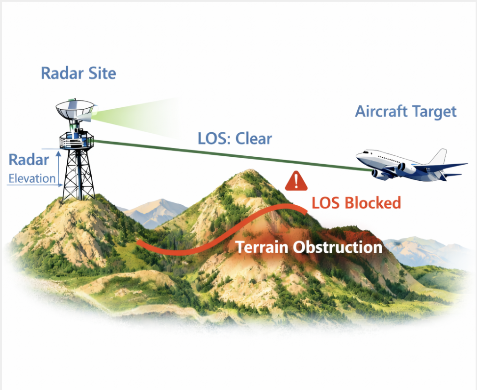
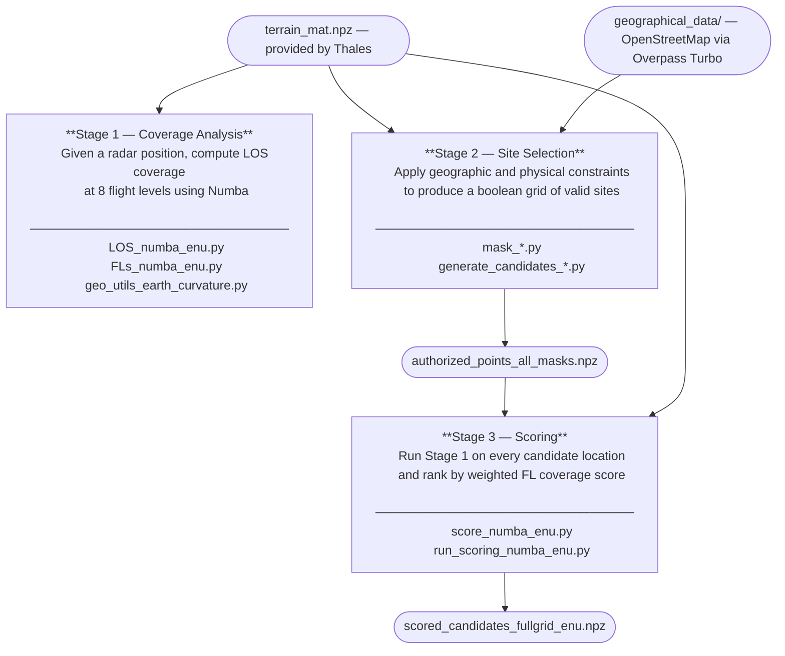
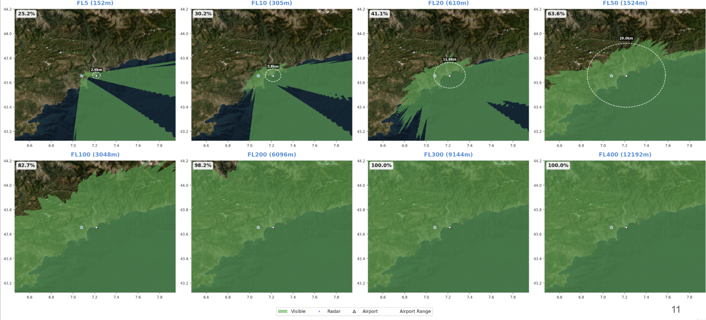
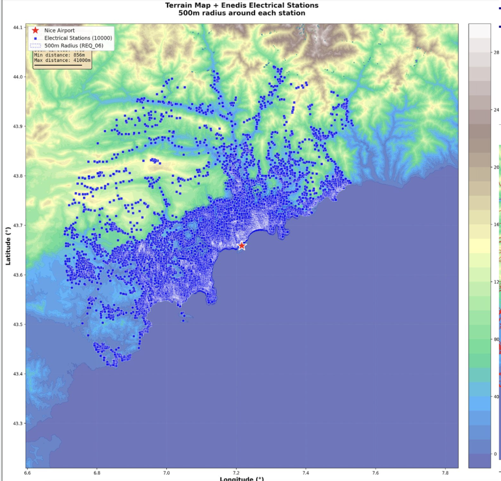

# Radar Site Placement Optimizer

Given terrain elevation data and geographic constraints, find and rank the best locations to place a surveillance radar to maximize airspace coverage over the Nice / French Riviera area.

This project was developed as part of a mission for **Thales**. It is structured as a **3-stage pipeline**, each stage implemented as both a standalone Python script and a page in a Streamlit web app.



---

## Pipeline Overview



---

## Quick Start

```bash
python -m venv .venv
source .venv/bin/activate        # macOS/Linux
# .venv\Scripts\activate         # Windows

pip install -r requirements.txt
streamlit run radar_coverage_app.py
```

> **Note:** Numba JIT-compiles the LOS kernel on first run. The first execution will be slower — subsequent runs are fast.

---

## Stage 1 — Radar Coverage Analysis

### What it does

Given a radar defined by `(lat, lon, height above ground)`, compute which points in the terrain grid are **visible** at each of the 8 supported flight levels, using a **Line of Sight (LOS)** model.

For each target point, the algorithm samples the radar → target ray at regular intervals and checks whether the terrain altitude stays below the LOS altitude at every sample. If any sample is blocked, the point is not visible.

### Why Numba?

LOS must be computed for every terrain point (potentially millions) at every flight level. Each check requires sampling 100+ points along the ray. Pure Python is far too slow for this. **Numba** JIT-compiles the inner loop to machine code and runs it in parallel across CPU cores using `prange`.

### Coordinate system: ENU + Earth curvature

Lat/lon coordinates are converted to a local **ENU (East-North-Up)** metric frame (X = East meters, Y = North meters from a reference point). This lets all distance/slope/LOS computations work in meters.

At 50km scale, Earth's curvature matters. A correction is applied to the terrain elevation:

```
Z_corrected = Z_terrain - d² / (2R)
```

where `d` is the horizontal distance to the radar and `R` is Earth's radius. Without this, distant terrain appears artificially higher than it really is relative to the LOS ray.

### Flight levels

| Flight Level | Altitude (m) |
|---|---|
| FL5 | ~152 m |
| FL10 | ~305 m |
| FL20 | ~610 m |
| FL50 | ~1524 m |
| FL100 | ~3048 m |
| FL200 | ~6096 m |
| FL300 | ~9144 m |
| FL400 | ~12192 m |

Conversion: `FL × 100 × 0.3048`

### Key files

| File | Role |
|---|---|
| `LOS_numba_enu.py` | Numba LOS kernel — samples each ray, checks terrain blockage, returns coverage map |
| `FLs_numba_enu.py` | Full-grid coverage for one flight level |
| `geo_utils_earth_curvature.py` | Lat/lon → ENU meters with Earth curvature correction |
| `geo_utils.py` | Base coordinate utilities (used by scoring stage) |
| `main_coverage.py` | **Standalone script**: compute coverage for all FLs, save maps and export KMZ |



---

## Stage 2 — Site Selection (Constraint Masks)

### What it does

Build a **boolean grid** over the terrain where `True` = valid radar placement, `False` = forbidden. Each constraint is computed as a separate mask and then combined.

### Data collection

Geographic constraint data (roads, buildings, electrical stations, protected areas) was retrieved from **OpenStreetMap** using **[Overpass Turbo](https://overpass-turbo.eu/)** queries, then exported as GeoJSON files stored in `geographical_data/`.

Geographic boundary constraints (French territory, coastline, 50km study radius) were applied directly in Python using lat/lon arithmetic — no external data required.

### Constraints

| Constraint | Description | Method | File |
|---|---|---|---|
| Study area | 50km radius from Nice | Lat/lon distance filter | `mask_site_location.py` |
| French territory | Exclude points outside France | Lat/lon bounding | `mask_site_location.py` |
| Coastline buffer | Exclude sea and coastal strip | Lat/lon + elevation | `mask_site_location.py` |
| Terrain slope | Exclude slopes above threshold | Gradient of elevation grid | `mask_slope.py` |
| Road proximity | Must be within X meters of a road | Buffer around OSM road lines | `mask_roads.py` |
| Building exclusion | Must be > X meters from buildings | Buffer around OSM building polygons | `mask_buildings.py` |
| Residential exclusion | Exclude residential zones | OSM residential polygons | `mask_residential.py` |
| Protected areas | Exclude national parks, forests | OSM protected area polygons | `mask_protected_areas.py` |
| Electrical stations | Must be within X meters of a power station | Buffer around OSM station points | `mask_electric_stations.py` |
| Airport LOS | Must have line of sight to the airport | Numba LOS check | `mask_see_airport.py` |



### Candidate generation

Once all masks are combined, the remaining `True` points are the candidate locations:

- `generate_candidates_full_constraints.py` — Apply all constraints → saves `authorized_points_all_masks.npz`
- `generate_candidates_no_residential.py` — Relax the residential constraint → saves `authorized_points_no_res.npz`

---

## Stage 3 — Scoring & Ranking

### What it does

Run the Stage 1 coverage analysis on **every candidate location** and rank them by a weighted coverage score.

### Scoring method

For each candidate, the coverage percentage is computed at each of the 8 flight levels. These are then combined into a single score using a **weighted sum** — lower flight levels (FL5, FL10, FL20) receive higher weights, because low-altitude coverage is harder to achieve over mountainous terrain and is operationally more critical.

### Key files

| File | Role |
|---|---|
| `score_numba_enu.py` | Numba scoring engine — runs full-grid LOS for one candidate, returns weighted score and per-FL coverage |
| `run_scoring_numba_enu.py` | **Standalone script**: loads candidates NPZ, scores all of them, saves ranked results to `scored_candidates_fullgrid_enu.npz` |

### Output format

The output NPZ contains, for each candidate:
- `lat`, `lon` — location
- `score` — weighted aggregate score
- `cov_by_fl` — coverage % at each of the 8 flight levels

---

## Streamlit App

`streamlit run radar_coverage_app.py` opens a 3-page web UI, one page per stage:

**Page 1 — Coverage Analysis**
Load a terrain file, set radar position and height, compute coverage maps for all flight levels, visualize results, export to KMZ (Google Earth).

**Page 2 — Site Selection**
Configure each constraint (distance thresholds, GeoJSON uploads), apply masks interactively, visualize the combined candidate map, export candidate locations.

**Page 3 — Scoring Results**
Load a candidate NPZ, run the scoring, view the ranked table with per-FL breakdown, export top sites as KMZ.

---

## Repository Structure

```
modelling_radar_thales/
│
├── radar_coverage_app.py                  # Streamlit app entry point + shared utilities
├── pages/
│   ├── 1_Coverage_Analysis.py             # App page 1
│   ├── 2_Site_Selection.py                # App page 2
│   └── 3_Scoring_Results.py               # App page 3
│
├── LOS_numba_enu.py                        # Stage 1 — Numba LOS kernel
├── FLs_numba_enu.py                        # Stage 1 — Full-grid coverage for one FL
├── geo_utils_earth_curvature.py            # Stage 1 — Lat/lon → ENU + curvature correction
├── geo_utils.py                            # Stage 1 — Base coordinate utilities
├── main_coverage.py                        # Stage 1 — Run all FLs, export KMZ
│
├── mask_site_location.py                   # Stage 2 — Land boundary, radius, French territory
├── mask_slope.py                           # Stage 2 — Slope threshold
├── mask_roads.py                           # Stage 2 — Road proximity
├── mask_buildings.py                       # Stage 2 — Building exclusion buffer
├── mask_residential.py                     # Stage 2 — Residential area exclusion
├── mask_protected_areas.py                 # Stage 2 — Protected areas exclusion
├── mask_electric_stations.py               # Stage 2 — Electrical station proximity
├── mask_see_airport.py                     # Stage 2 — Airport LOS constraint
├── generate_candidates_full_constraints.py # Stage 2 — All masks → candidates NPZ
├── generate_candidates_no_residential.py   # Stage 2 — Relax residential constraint
│
├── score_numba_enu.py                      # Stage 3 — Numba scoring engine
├── run_scoring_numba_enu.py                # Stage 3 — Score all candidates, rank
│
├── export_kml.py                           # Export — Coverage maps → KMZ
├── export_site_location_masks_kml.py       # Export — Masks → KMZ
├── export_scored_points_weighted_kml.py    # Export — Scored candidates → KMZ
├── export_authorized_points_kml.py         # Export — Candidate points → KMZ
├── export_protected_areas_mask_kml.py      # Export — Protected areas mask → KMZ
├── export_slope_mask_kml.py                # Export — Slope mask → KMZ
│
├── visualize_coverage.py                   # Visualization — Coverage map plots
├── visualize_terrain.py                    # Visualization — Terrain 2D/3D plots
├── visualize_site_location_masks.py        # Visualization — Mask overlay plots
├── visualize_authorized_points_kml.py      # Visualization — Candidate points
├── buildings_png.py                        # Visualization — Buildings map render
├── elecstations.py                         # Visualization — Electrical stations render
├── roads_png.py                            # Visualization — Roads map render
├── terrain_roads.py                        # Visualization — Terrain + roads render
│
├── terrain_mat.npz                         # Data — Terrain elevation grid (provided by Thales)
├── terrain_req01_50km.npz                  # Terrain grid at 50km resolution
├── authorized_points_all_masks.npz         # Pre-computed candidates (all constraints)
├── authorized_points_no_res.npz            # Pre-computed candidates (no residential)
│
├── geographical_data/
│   ├── buildings.geojson                   # OSM buildings (Overpass Turbo)
│   ├── roads_nice_50km.geojson             # OSM road network (Overpass Turbo)
│   ├── protected_areas.geojson             # OSM protected areas (Overpass Turbo)
│   └── export.geojson                      # Study area boundary
│
└── requirements.txt
```

---

## Terrain Data Format

The terrain NPZ file must contain:

| Key | Type | Description |
|---|---|---|
| `lat` | 1D array | Latitudes in degrees (WGS84) |
| `lon` | 1D array | Longitudes in degrees (WGS84) |
| `ter` | 2D array `(len(lat), len(lon))` | Elevation in meters above sea level |

---

## Requirements

```
numpy, matplotlib, streamlit     # core
numba                            # required — LOS performance
shapely, pyproj                  # geospatial operations
contextily                       # optional — basemap tiles
plotly, scipy, pillow            # additional utilities
```

Install: `pip install -r requirements.txt`

---

## Troubleshooting

**First run is slow**
Numba compiles the LOS kernel on first execution. Run once, then rerun — subsequent runs are significantly faster.

**Coverage changes with grid resolution**
Changing the terrain grid resolution changes which target points are evaluated. For reproducible comparisons, always use the same terrain file, radar height, number of ray samples, and coordinate reference.
